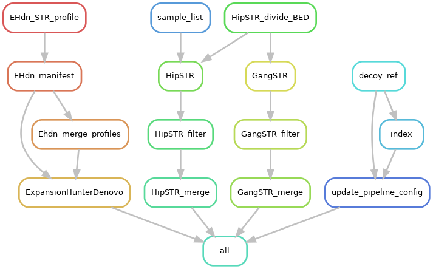

# STR-genotyping snakemake pipeline
This Snakemake pipeline detects Short Tandem Repeats (STRs) in genomic samples. It supports multiple STR genotyping tools :
-	ExpansionHunter Denovo 
-	HipSTR
-	GangSTR 
-	STRetch 

This pipeline was built using high-coverage CRAM files, but it should also work for BAM files.

## Installation
### Requirements
- Conda, here is the [documentation](https://github.com/conda-forge/miniforge) on how to install it.
- Snakemake, this is included in the Snakemake environment file

### Setup
1.	Clone the git repository:
```
$ git clone https://github.com/AliceAnsong/BIT11_internship.git
```
2.	Create the conda environment using the snakemake.yaml file provided in the envs directory:
```
$ cd BIT11_internship/pipeline/
$ conda env create -f envs/snakemake.yaml
```
3.	Activate the environment :
```
$ conda activate snakemake
```

### Tools
Install the following tools using their GitHub documentation in a tools subdirectory of BIT11_internship/pipeline/ so that determining paths is a bit easier:
-	ExpansionHunter Denovo: 
https://github.com/Illumina/ExpansionHunterDenovo
-	HipSTR:
https://github.com/HipSTR-Tool/HipSTR
-	STRetch:
https://github.com/Oshlack/STRetch
- [GangSTR](https://github.com/gymreklab/GangSTR) is already included in the snakemake.yaml file so it does not need to be installed again.
- TRTools:
https://github.com/gymrek-lab/TRTools

## Running the pipeline
1.	Go to the directory:
```
$ cd BIT11_internship/pipeline/
```
2.	Activate the conda environment :
```
$ conda activate snakemake
```
3.	Place your sample files (CRAM/BAM) in a subdirectory.
4.	Place your reference genome in another subdirectory and download the correct [HipSTR BED file](https://github.com/HipSTR-Tool/HipSTR-references/) in that same subdirectory.
The exact names of these subdirectories does not matter, because their paths need to be defined in the config.yaml file.
5.	Modify the config.yaml file
6.	A couple of things need to be added to your .bashrc to make tools executable wherever (modify paths as needed):
```
export PATH="tools/EHdn/bin:$PATH" 
export PATH="tools/HipSTR:$PATH"
export PATH="tools/STRetch/tools/bwa.kit:$PATH"
export PATH="tools/STRetch/tools/bin:$PATH"
```
7.	Run Snakemake; it is recommended to use SLURM. This pipeline also requires `–use-conda` for managing environments per rule
```
$ snakemake --profile slurm --use conda
```
## Output
Example of how your directory may look after running this pipeline:
```
BIT11_internship/pipeline/
├── config.yaml
├── dag.png
├── envs
│   ├── HipSTR_filter.yaml
│   └── snakemake.yaml
├── manifest.sh
├── references
│   ├── GRCh38.fasta
│   └── hg38.hipstr_reference.bed
├── results
│   ├── dataset_EHdn.tsv
│   ├── dataset_GangSTR_A.vcf
│   ├── dataset_HipSTR.vcf
│   ├── EHdn_prep
│   ├── GangSTR_prep
│   ├── HipSTR_prep
│   ├── STRetch
│   └── STRetch_prep
├── sample_data
│   ├── A.crai
│   └── A.cram
├── tools
│   ├── Ehdn
│   ├── HipSTR
│   ├── STRetch
│   └── TRTools
├── Snakefile
└── temp.txt
```
When using multiple samples, ExpansionHunter Denovo and HipSTR will output one tsv/vcf file, while GangSTR will output a vcf file per sample.

## DAG of pipeline


## To do
- [x] ~~Add rule that merges HipSTR output files~~
- [ ] Format output files of tools, so they can be compared
- [ ] Add a section that compares output and determines the consensus STR calls per sample
